<p align="center">
  
</p>

<h1 align="center">Prime News</h1>

<p align="center">
Role-Based E-News Publishing Platform with Secure Authentication, Content Management, Smart Reading Features, and PDF Reporting
</p>

------------------------------------------------------------------------


> **Prime News** is a modern role-based E-News publishing platform developed using **PHP**, **MySQL**, **HTML**, **CSS**, and **JavaScript**. The platform provides dedicated interfaces for **Users**, **Journalists**, and **Administrators**, enabling secure news publishing, category management, OTP-based email verification, article translation, text-to-speech, bookmarking, and PDF reporting within a centralized content management workflow.

------------------------------------------------------------------------

# 🚀 Live Demo

> 🌐 Live Application:
> https://prime-news-4710.my-board.org/

### 🔑 Demo Credentials

#### 👤 User

Email: `testdemo@gmail.com`

Password: **PrimeNews@123**

#### 📝 Journalist

Username: **journalist**

Password: **journalist123**

#### 🔐 Admin

Username: **admin**

Password: **admin123**

> **Note:** Since the application is hosted on a free hosting service, the first request may take a few seconds to load.

------------------------------------------------------------------------

# 🌟 Highlights

- 📰 Complete Role-Based News Management System
- 👤 Three Dedicated User Roles
- 📧 OTP Email Verification using PHPMailer
- 🌐 Multi-language Article Translation
- 🔊 Text-to-Speech News Reader
- ❤️ Like & Bookmark News Articles
- 📤 Share Articles Instantly
- 🌙 Dark Mode Support
- 📄 PDF Report Generation using TCPDF
- 🎥 Image & Video Support
- 📂 Category Management
- 🔐 Secure Authentication & Access Control

------------------------------------------------------------------------

## 📸 Application Preview

### Authentication

| User Login | User Registration |
|------------|-------------------|
| 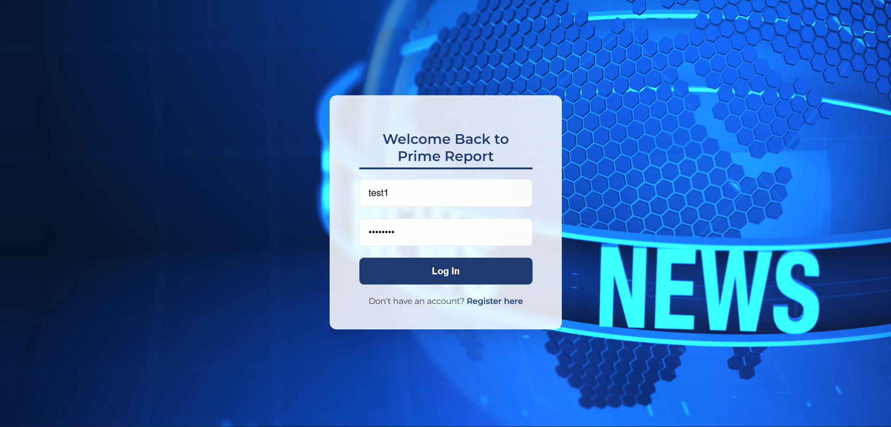 | 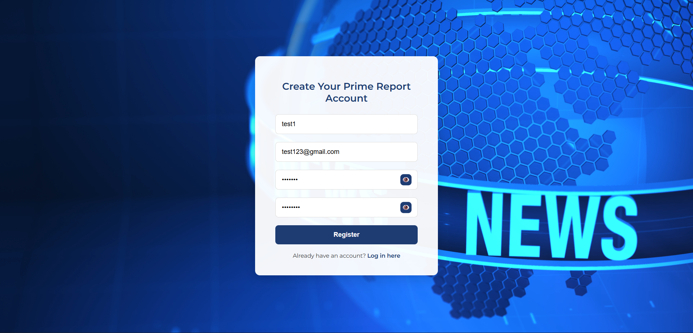 |

---

### User Portal

| Home | News Details |
|------|--------------|
| 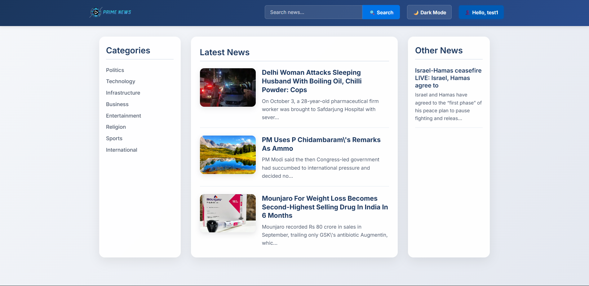 | 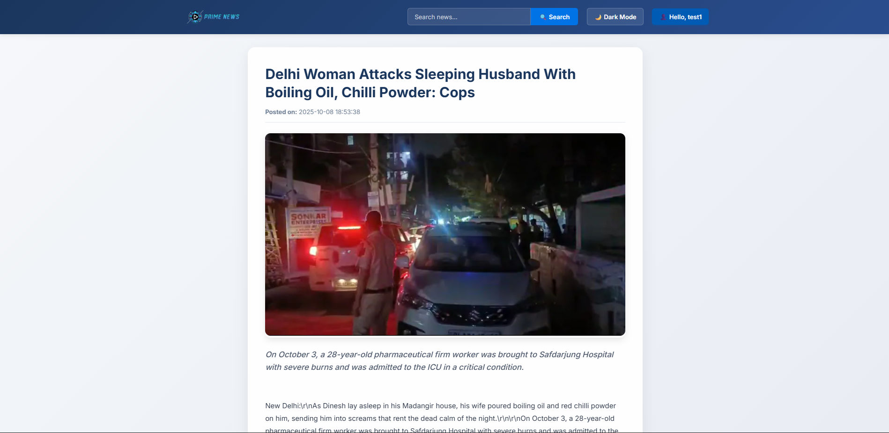 |

| Smart Reading Features | Saved News |
|------------------------|------------|
| 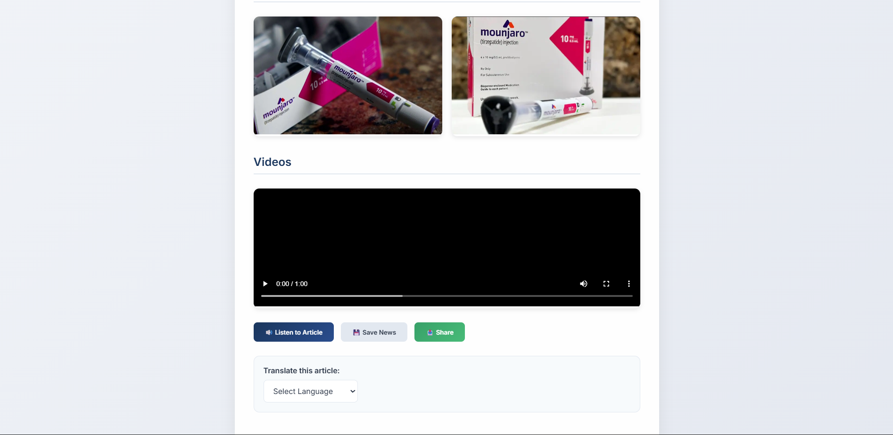 | 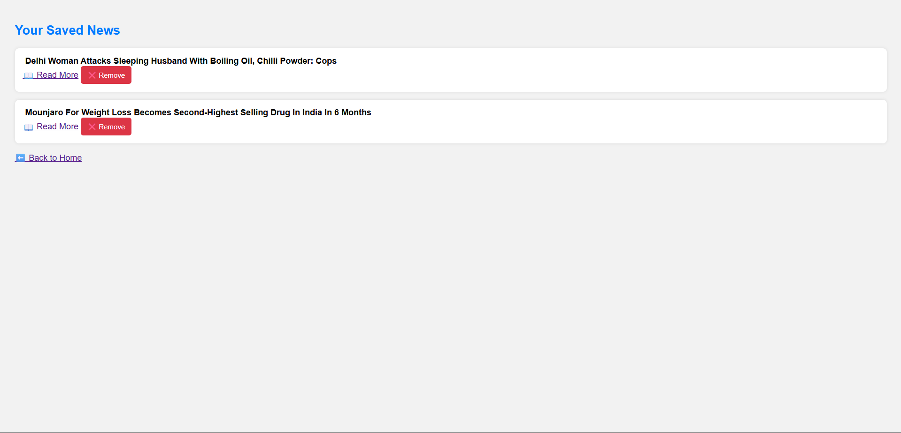 |

---

### Journalist Portal

| Login | Dashboard |
|-------|-----------|
| 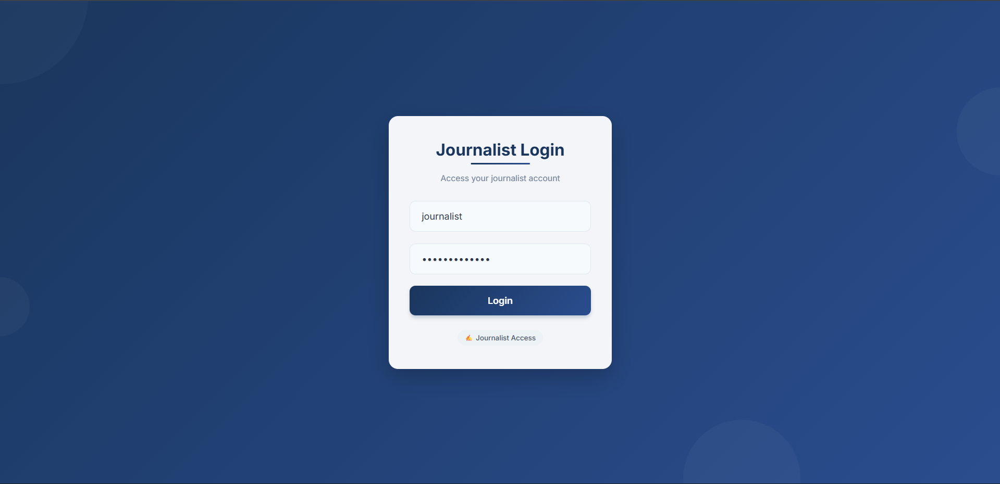 | 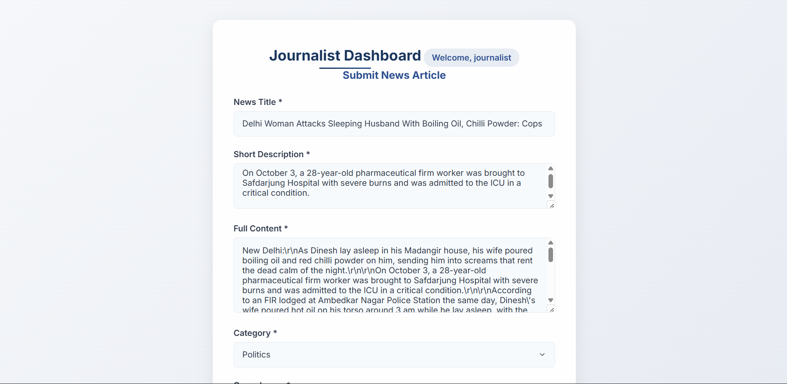 |

| News Management |
|-----------------|
| 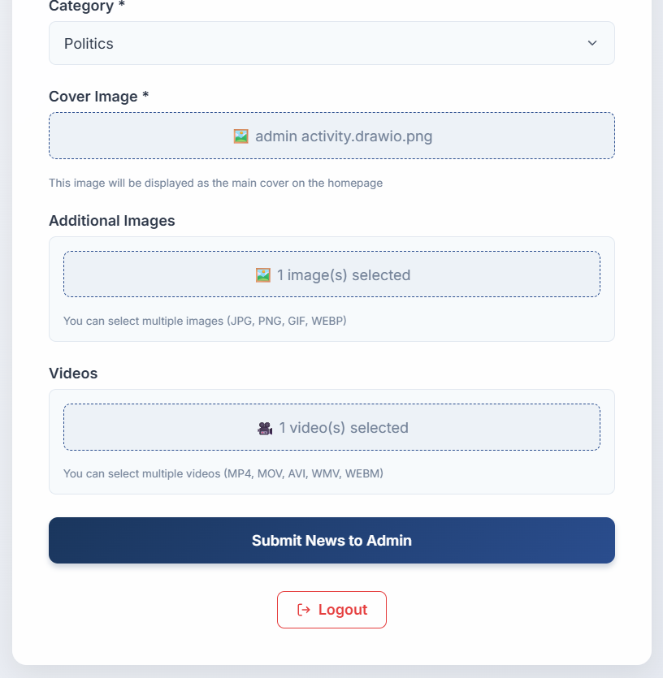 |

---

### Admin Portal

| Login | Dashboard |
|-------|-----------|
| 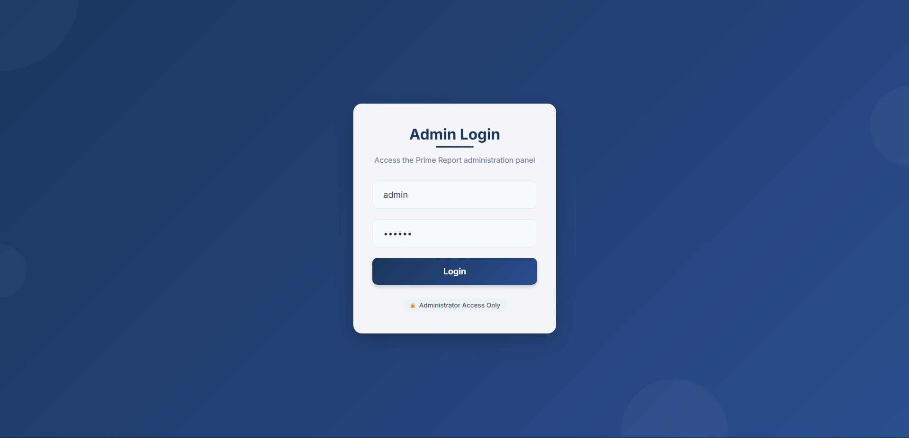 | 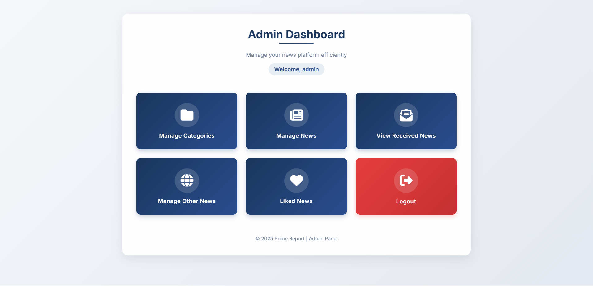 |

| Category Management | Pending News |
|--------------------|--------------|
| 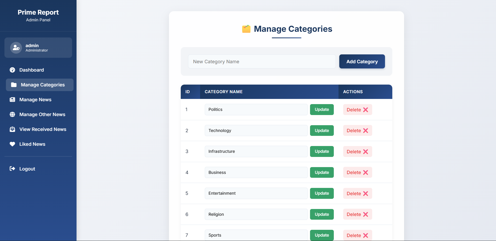 | 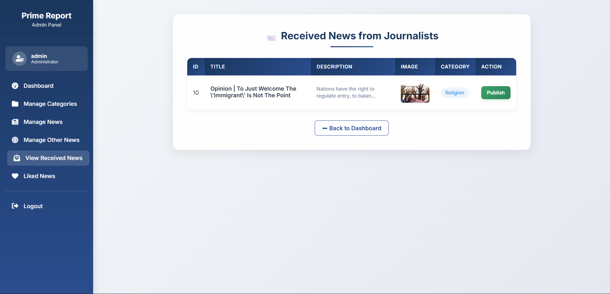 |

| Published News Management | News Analytics |
|---------------------------|----------------|
| 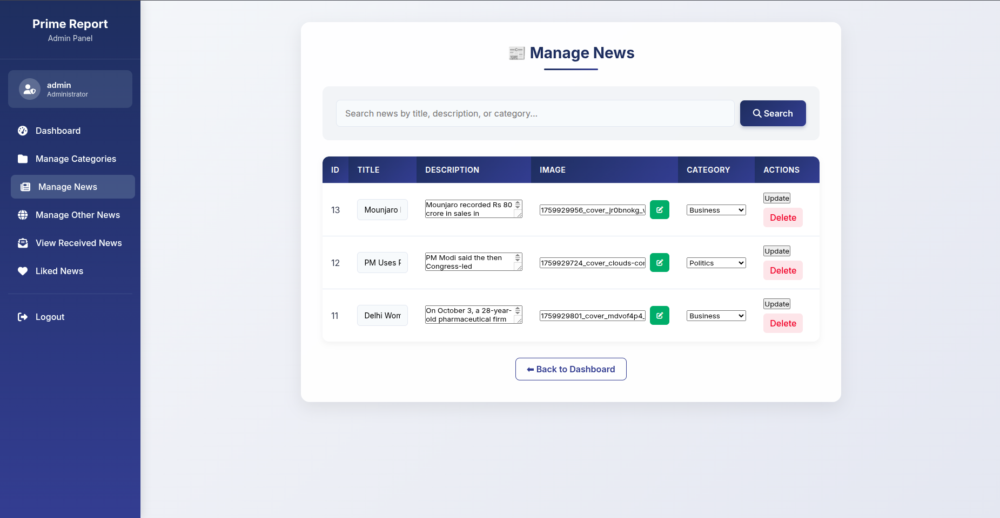 | 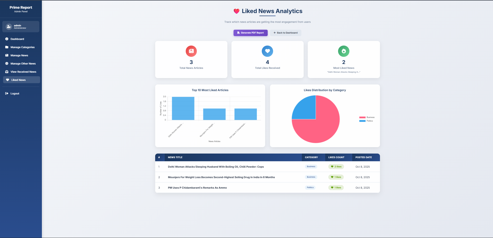 |

| Other News |
|------------|
| 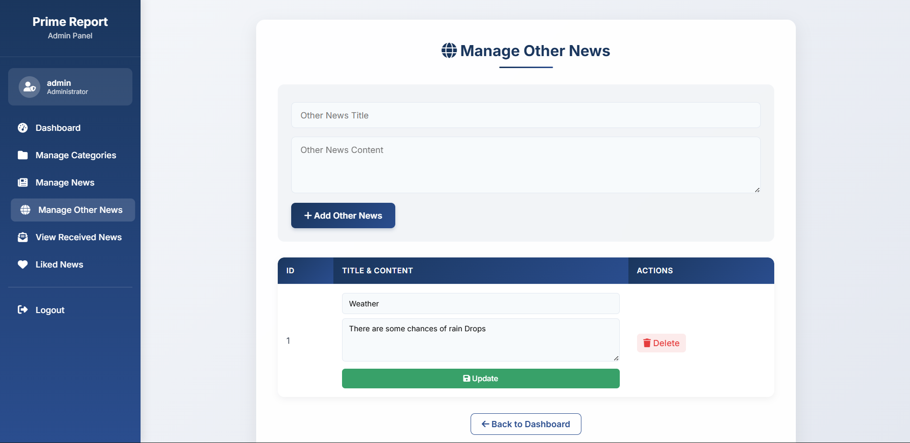 |

------------------------------------------------------------------------

# ✨ Features

## 👤 User Portal

- Secure user registration and login
- OTP email verification using PHPMailer
- Browse news across multiple categories
- Search news articles
- Filter articles by category
- Read detailed news articles
- View articles with images and videos
- Like news articles
- Bookmark favorite news
- Remove saved articles
- Share articles
- Translate articles into multiple languages
- Listen to articles using Text-to-Speech
- Dark Mode support

------------------------------------------------------------------------

## 📝 Journalist Module

- Secure journalist login
- Create news articles
- Upload images
- Upload videos
- Submit articles for admin approval
- Manage submitted news

------------------------------------------------------------------------

## 🔐 Admin Panel

- Secure administrator login
- Publish approved news
- Add news
- Edit news
- Update news
- Delete news
- Approve journalist submissions
- Manage categories
- View liked news
- Generate PDF reports using TCPDF
- Manage website content efficiently

------------------------------------------------------------------------

## 🌐 Smart Reading Features

- 🌍 Multi-language article translation
- 🔊 Text-to-Speech news reader
- ❤️ Like articles
- 🔖 Save articles
- 📤 Share articles
- 🌙 Dark Mode

------------------------------------------------------------------------

## 📧 Email Verification

- OTP-based email verification
- PHPMailer integration
- Secure registration process
- Prevents fake account creation

------------------------------------------------------------------------

## 🔐 Authentication & Access Control

- Role-based authentication
- Separate login portals
- Protected user features
- Session management
- Secure access control
- Admin approval workflow for news publishing

------------------------------------------------------------------------

# 👥 User Roles

| Role | Responsibilities |
|------|------------------|
| 👤 **User** | Register, login, browse news, search articles, like, bookmark, translate, listen to articles, and share news |
| 📝 **Journalist** | Create news articles, upload images/videos, manage submitted articles, and submit content for admin approval |
| 🔐 **Admin** | Approve and publish news, manage articles, categories, user engagement, and generate PDF reports |

------------------------------------------------------------------------

# 🛠 Tech Stack

| Layer | Technology |
|-------|------------|
| Frontend | HTML5, CSS3, JavaScript |
| Backend | PHP |
| Database | MySQL |
| Email Service | PHPMailer |
| PDF Generation | TCPDF |
| Web Server | Apache (XAMPP / WAMP) |
| Authentication | Session-based Authentication |
| Version Control | Git & GitHub |

------------------------------------------------------------------------

# 🏗️ Architecture

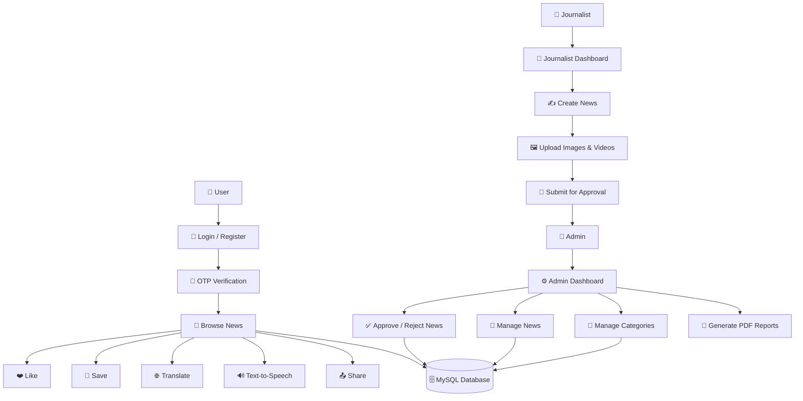

------------------------------------------------------------------------

# 📁 Project Structure

```text
Prime-News-E-News-Web-Platform/
│
├── assets/
│   └── logo_rectangle.png
│
├── doc/
│   └── Project Documentation
│
├── screenshots/
│   ├── admin-dashboard.png
│   ├── admin-login.png
│   ├── article-features.png
│   ├── category-management.png
│   ├── journalist-dashboard.png
│   ├── journalist-login.png
│   ├── journalist-manage-news.png
│   ├── news-details.png
│   ├── news-likes.png
│   ├── news-management.png
│   ├── other-news.png
│   ├── pending-news.png
│   ├── saved-news.png
│   ├── user-home.png
│   ├── user-login.png
│   └── user-registration.png
│
├── src/
│   ├── code/
│   │   ├── admin/
│   │   ├── journalist/
│   │   ├── user/
│   │   ├── includes/
│   │   ├── css/
│   │   ├── js/
│   │   └── index.php
│   │
│   ├── database/
│   │   └── prime_news.sql
│   │
│   ├── images/
│   │
│   └── uploads/
│
├── README.md
└── .gitignore
```

------------------------------------------------------------------------

# ⚙️ Installation

## Clone Repository

```bash
git clone https://github.com/tirthrmodi4710/Prime-News-E-News-Web-Platform.git

cd Prime-News-E-News-Web-Platform
```

------------------------------------------------------------------------

## Move Project

Copy the project folder into your local web server directory.

**XAMPP**

```text
htdocs/
```

**WAMP**

```text
www/
```

------------------------------------------------------------------------

## Create Database

1. Start **Apache** and **MySQL**
2. Open **phpMyAdmin**
3. Create a new database

Example

```text
prime_news
```

------------------------------------------------------------------------

## Import SQL File

Import the SQL file located in:

```text
src/database/prime_news.sql
```

------------------------------------------------------------------------

## Configure Database

Update your database credentials in the project's database configuration file.

```php
$host = "localhost";
$user = "root";
$password = "";
$database = "prime_news";
```

------------------------------------------------------------------------

## Configure PHPMailer

Open the mail configuration file and update the following values:

```text
SMTP Host
SMTP Username
SMTP Password
SMTP Port
Sender Email
```

This enables OTP email verification during user registration.

------------------------------------------------------------------------

## Run the Application

Start Apache and MySQL, then open your browser.

```text
http://localhost/Prime-News-E-News-Web-Platform
```

------------------------------------------------------------------------

# 🔑 Demo Credentials

## 🔐 Admin

| Username | Password |
|-----------|----------|
| admin | admin123 |

---

## 📝 Journalist

| Username | Password |
|-----------|----------|
| journalist | journalist123 |

---

## 👤 User

Create a new account and verify it using the OTP sent to your registered email.

------------------------------------------------------------------------

# 📦 Dependencies

```text
PHP

MySQL

Apache

HTML5

CSS3

JavaScript

PHPMailer

TCPDF
```

------------------------------------------------------------------------

# 🧠 Workflow

```text
User Registration
        ↓
OTP Email Verification
        ↓
User Login
        ↓
Browse News Articles
        ↓
Like • Save • Share • Translate • Listen
        ↓
Journalist Creates News
        ↓
Upload Images & Videos
        ↓
Submit for Admin Approval
        ↓
Admin Reviews News
        ↓
Approve & Publish
        ↓
News Available to All Users
        ↓
Generate PDF Reports
```

------------------------------------------------------------------------

# 🔒 Security

- OTP-based email verification using PHPMailer.
- Role-based authentication for Users, Journalists, and Administrators.
- Session-based access control.
- Protected features available only to authenticated users.
- News published only after administrator approval.
- Secure database connectivity using MySQL.
- User passwords are securely stored in the database.
- File uploads are restricted to authorized users.
- SQL database credentials are stored separately from application logic.

------------------------------------------------------------------------

# 📚 Key Learnings

Throughout the development of **Prime News**, I gained practical experience in:

- Building a complete full-stack web application using PHP and MySQL.
- Designing a role-based authentication and authorization system.
- Implementing OTP-based email verification using PHPMailer.
- Managing CRUD operations for news articles and categories.
- Working with file uploads for images and videos.
- Developing a news approval workflow between Journalists and Admin.
- Implementing smart article features such as translation and text-to-speech.
- Generating dynamic PDF reports using TCPDF.
- Managing sessions and secure user authentication.
- Designing responsive and user-friendly interfaces using HTML, CSS, and JavaScript.
- Structuring a scalable PHP project with separate modules for different user roles.
- Deploying and maintaining a live web application.

------------------------------------------------------------------------

# 🎯 Project Highlights

This project demonstrates proficiency in:

- Full-Stack Web Development
- PHP & MySQL Application Development
- Role-Based Access Control (RBAC)
- Session Management
- Email Integration
- PDF Report Generation
- Database Design
- File Upload Management
- Dynamic Web Interfaces
- Frontend & Backend Integration
- Real-World CRUD Operations

------------------------------------------------------------------------

# 🚀 Future Enhancements

- RESTful API integration
- Progressive Web App (PWA) support
- Mobile-first responsive redesign
- AI-powered personalized news recommendations
- Real-time notifications
- Comment and discussion system
- User profile management
- Advanced search with filters
- Trending news analytics
- Multi-language user interface
- Admin analytics dashboard
- Cloud deployment with CI/CD pipeline

------------------------------------------------------------------------

# 👨‍💻 Author

**Tirth Modi**

- GitHub: https://github.com/tirthrmodi4710

------------------------------------------------------------------------

# 📄 License

This project is licensed under the **MIT License**.

Feel free to use, modify, and distribute this project in accordance with the license terms.

------------------------------------------------------------------------

# 🙏 Acknowledgements

Special thanks to the open-source technologies that made this project possible:

- PHP
- MySQL
- PHPMailer
- TCPDF
- HTML5
- CSS3
- JavaScript
- Apache

------------------------------------------------------------------------

⭐ **If you found this project helpful, consider giving it a star on GitHub!**

------------------------------------------------------------------------

> Built with ❤️ using PHP, MySQL, HTML, CSS, and JavaScript.